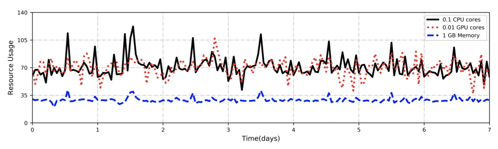

# EdgeCloudBenchmark
该负载生成器是用来生成云边协同场景负载的，该生成器是以真实日志为驱动的（真实日志信息详见[Alibaba's cluster trace](https://github.com/alibaba/clusterdata)）
## Table of contenes
- [1 背景介绍](#1-背景介绍)
- [2 trace特征分析](#2-trace特征分析)
    - [2.1 Normal BenchMark](#21-normal-benchmark)
        - [2.1.1 实例完成情况](#211-实例完成情况)
        - [2.1.2 作业和任务分配情况](#212-作业和任务分配情况)
        - [2.1.3 作业资源时候用情况](#213-作业资源使用情况)
        - [2.1.4 任务间DAG依赖](#214-任务间DAG依赖)
- [3 运行前置准备](#3-运行前置准备)
    - [3.1 csv表格式](#31-csv)
        - [3.1.1 Normal BenchMark](#311-normal-benchmark)
        - [3.1.2 AI BenchMark](#312-ai-benchmark)
    - [3.2 代码层级](#32-代码层级)
- [4 负载生成生算法和负载提交器](#4-负载生成生算法和负载提交器)
    - [4.1 负载生成算法](#41-负载生成算法)
        - [4.1.1 任务数量生成器](#411-任务数量生成器)
        - [4.1.2 任务资源生成器](#412-任务资源生成器)
        - [4.1.3 任务DAG依赖生成器](#413-任务DAG依赖生成器)
        - [4.1.4 云边协同任务生成器](#414-云边协同任务生成器)
    - [4.2 负载提交模式](#42-负载提交模式)
- [5 项目成员](#5-项目成员)
    - [5.1 北京理工大学](#51-北京理工大学)


## 1 背景介绍
云计算是继互联网、计算机后在信息时代又一种革新，中国信通院（CAICT）在《云计算发展白皮书（2020年）》指出，云计算将在未来十年进入全新发展阶段。边缘计算作为云计算范式的扩展，可以通过配置更多的边缘节点来负载流量，从而达到提高数据传输速率、减少网络带宽消耗、降低能源消耗等目的。但是边缘设备的资源一般较少，在边缘端收到无法处理的负载，往往需要与云端进行协同工作。为了优化云边协同场景下的负载调度，学者们提出了不同的资源调度算法，但这些资源调度算法缺少基准测试集来衡量其调度效果。基于此，该项目开发了云边协同场景下的基准测试集生成系统。

## 2 trace特征分析
### 2.1 Normal BenchMark
#### 2.1.1 实例完成情况
通常一个批处理作业包含多个任务，每个任务执行不同的业务逻辑，实例是批处理作业调度的最小单位。对于批处理而言，任务中的所有实例执行相同的应用程序代码，请求相同的资源，但输入的数据不同。


#### 2.1.2 作业和任务分配情况
有的批处理作业都由一个或多个任务构成，每个任务又包含一个或多个实例。 为了得到 job 和 task 的特征，我们在给出了 job 编号与 task 数量的关系，我们可以看到，大多数的 job 所含的 task 数量少于150。


#### 2.1.3 作业资源使用情况
批处理任务请求资源量呈现周期化。离线批处理作业的调度操作，在本质上是通过实例调度实现的，实例是批处理任务运行的最小单位，批处理任务在提交时需要填写需求的资源量。


#### 2.1.4 任务间DAG依赖
大部分批处理任务都存在着 DAG 依赖。我们根据同一个 job 中 task 之间的依赖关系将分为了三种类型，这三类任务分别为:
- 无 DAG 关系任务。这类 task 表示 该 task 所属 job 无 DAG 结构，任务可并行化。
- 有 DAG 关系、有依赖任务。这类任务至少有一个前驱节点。
- 有 DAG 关系、无依赖任务。该类 task 所属 job 有 DAG 依赖、但该 task 不含任何前驱节点。

具体任务所占比例情况如下图所示。根据我们对 task 的 分类，我们绘制了这三种任务在集群日志中的分布情况，大部分 任务存在 DAG 关系，我们生成基准测试集时也要生成符合日志分布的 DAG 关系。


### 2.2 AI BenchMark
#### 2.2.1 作业和任务分配情况
与 CPU 集群相似，GPU 集群中作业和任务之间也存在着周期性的特征，GPU 集群的任务大部分在中午 11 时至下午 14 时之间提交，而每个作业所含的 task 数量也存在着周期性的变化，下图展示了作业与任务随时间的周期性变化。


#### 2.2.2 作业资源使用情况
任务请求资源量呈现周期化。GPU 集群和 CPU 集群类似，GPU 集群上作业的调度操作，在本质上是通过实例调度实现的，实例是 GPU 集群任务运行的最小单位，GPU 集群任务在提交时需要填写需求的资源量。下图展示了 GPU 集群任务在集群中平均的资源请求量，可以看出每日的 18 时至第二日的 6 时，GPU 集群任务需求的资源最大，且呈现周期性，这说明 GPU 集群中也存在昼夜模式。

资源请求存在重尾分布。下面三个子图分别描述了所有实例请求的总 CPU、GPU 和内存的分布。经分析，这三个分布都是重尾的，大概 20% 的实例请求大量资源，其余 80% 的实例请求少量资源。

用户倾向于请求比实际需要更多的资源。下面3个子图中的虚线代表了实例实际使用的 CPU、GPU 和内存请求，实线代表了用户请求的 CPU、GPU 和内存请求。可以看出，在大多数情况下，实线都位于虚线的右侧，这也说明了在实际集群中，用户倾向于要求比实际需求更多的资源。




## 3 运行前置准备
由于我们的生成器是根据真实日志来生成负载的，所以我们首先要去下载阿里巴巴的真实日志数据，并生成两个csv表（作业所含任务信息表、任务所含资源信息表）
### 3.1 csv表格式
#### 3.1.1 Normal BenchMark
在job-task.csv中，每行需要包含以下的列：
- task_count（每个作业所包含的Task请求数量）
- plan_cpu（每个作业所含任务的平均CPU请求量）
- plan_mem （每个作业所含任务的平均内存请求量）

在task-resource.csv中，每行需要包含以下的列：
- job_arrival_time （任务到达时间）
- duration （任务完成所需时间）
- request_cpu （任务所请求的CPU数量）
- request_mem （任务所请求的内存数量）
- inst_num （任务所含的实例数量）
- cpu_avg （任务所使用的CPU平均数量）
- cpu_max （任务所使用的CPU最大数量）
- mem_avg （任务所使用的内存平均数量）
- mem_max （任务所使用的内存最大数量）
- start_time （任务开始时间）
- end_time （任务结束时间）

#### 3.1.2 AI BenchMark
在job-task.csv中，每行需要包含以下的列：
- task_count（每个作业所包含的Task数量）
- plan_cpu（每个作业所含任务的平均CPU请求量）
- plan_mem （每个作业所含任务的平均内存请求量）
- plan_gpu （每个作业所含的平均GPU请求量）

在task-resource.csv中，每行需要包含以下的列：
- plan_cpu （任务所请求的CPU数量）
- plan_mem （任务所请求的内存数量）
- plan_gpu （任务所请求的GPU数量）
- cpu_avg （任务所使用的CPU平均数量）
- inst_num （任务所含的实例数量）
- max_mem （任务所使用的内存最大数量）
- avg_mem （任务所使用的内存平均数量）
- avg_gpu （任务所使用的GPU平均数量）
- max_gpu （任务所使用的GPU最大数量）
- avg_cpu （任务所使用的CPU平均数量）
- max_cpu （任务所使用的CPU最大数量）
- time_speed （任务完成所需时间）
- start_time （任务开始时间）
- end_time （任务结束时间）
### 3.2 代码层级
```shell script
EdgeCloudBenchmark
├── ai_bench  # 基于阿里巴巴2020日志生成AI负载
├── normal_bench # 基于阿里巴巴2018日志生成批处理负载
└── random_graph      # 随机图生成代码
```
## 4 负载生成生算法和负载提交器
```shell script
ai_bench
├── data_generator  # 配置文件生成
├── util # 工具包
├── generating_component # 负载生成算法组件
└── workload_submit  # 负载提交模式

normal_bench
├── dag_generator  # 任务dag依赖关系生成器
├── data_generator  # 配置文件生成
├── util # 工具包
├── generating_component # 负载生成算法组件
└── workload_submit  # 负载提交模式
```
负载的生成主要依靠的是负载生成算法，而负载则需要提交到集群上进行运行，我们设置了四种负载提交的方式。

### 4.1 负载生成算法
- 任务数量生成器
- 任务资源生成器
- 任务DAG依赖生成器
- 云边协同任务生成器
#### 4.1.1 任务数量生成器
每个时间段的作业与任务之间存在着不一样的分布，所 以当需要根据真实日志生成负载时，我们要使用任务数量生成器来生成作业与任务之间的关系。（以常规负载为例进行介绍）

主体类JobTaskRelation
```python3
class JobTaskRelation:
    def __init__(self, input_job_file)
    def random_task_count(self)
```
该类主要接收一个csv文件，也就是第一步中提到的job-task.csv，最后通过random_task_count方法来生成符合分布的作业所含任务数
```python
# demo
job_task_relation = JobTaskRelation('${path of your job-task.csv}')
job_task_relation.random_task_count() #  generate task_count per job
```
#### 4.1.2 任务资源生成器
分析发现任务请求资源量呈现周期化且存在资源过度使用的情况。为了生成符合真实日志资源分布的作业，我们采用常见的 K-means 聚类算法进行资源特征的提取。

主体类NormalTaskResource
```python3
class NormalTaskResource:
    def __init__(self, file_name_job, file_name_tasks, count_jobs, scene, task_percentage, edge_device, cloud_device)
    def random_jobs(self)
```
该类初始化的参数有如下几个
- file_name_job： 前置准备的job-task.csv文件
- file_name_tasks： 前置准备的task-resource.csv文件
- count_jobs： 想要生成的作业数量
- scene：想要生成的云边场景(edge-cloud, cloud-edge, edge-cloud-edge)
- task_percentage：作业中边缘任务所占的比例
- edge_device：边缘设备的资源数量
- cloud_device：云端设备的资源数量
```python
# demo
generate_jobs = NormalTaskResource('${path of your job-task.csv}', '${path of your task-resource.csv}', 1000, 'edge-cloud', 0.2, EdgeDevice(1, 2), CloudDevice(2, 4))
generate_jobs.random_jobs()
```

#### 4.1.3 任务DAG依赖生成器
在发现了生产集群DAG依赖存在的几个统计特性之后，我们希望能够根据真实日志的DAG关系生成基准测试集的DAG依赖。

主体方法
```python
def random_job(n):
    job_dag = random_dag(n)
    task_info = [*zip(
        [f'T{k}' + reduce(str.__add__, [f'_{p}' for p in v], '') for k, v in job_dag.items()],
    )]

    return {
        'tasks': [','.join(map(str, info)) for info in task_info],
    }
```
当输入作业所含的task数量后，就会随机生成符合真实日志分布的任务DAG依赖
```python
# 当想生成一个含有3个任务的作业，可以使用以下的语句
tasks = random_job(3)
```


#### 4.1.4 云边协同任务生成器
针对云边协同场景，我们将整个场景按照端与端之间通信的顺序划分成了边-云、云-边、边-云-边。当我们通过比例参数和设备参数生成了云端负载和边缘端负载后，我们需要根据传入的场景变量将这些负载任务组装成云边协同负载作业。

主体类BenchmarkGenerate
```python3
class BenchmarkGenerator:
    def __init__(self, task_percentage, device, scene, file_name_job, file_name_tasks, count_jobs)
    def random_job(self)
```
该类初始化的参数有如下几个
- task_percentage：作业中边缘任务所占的比例
- device 云边设备的资源
- scene：想要生成的云边场景(edge-cloud, cloud-edge, edge-cloud-edge)
- file_name_job： 前置准备的job-task.csv文件
- file_name_tasks： 前置准备的task-resource.csv文件
- count_jobs： 想要生成的作业数量

```python
# demo
generate_jobs = BenchmarkGenerator(0.2, {'cloud': {'cpu': 2, 'mem': 4}, 'edge': {'cpu': 1, 'mem': 2}}, 'edge-cloud', '${path of your job-task.csv}', '${path of your task-resource.csv}', 1000)
generate_jobs.random_job()
```

### 4.2 负载提交模式
我们生成完一批具有真实日志特点的负载之后，需要将负载进行提交以完成对调度算法效率评价的功能，我们最终可以生成负载的yaml配置文件用以进行负载的提交。
<table class="MsoTableGrid" border="1" cellspacing="0" cellpadding="0" style="border-collapse:collapse;border:none">
 <tbody><tr>
  <td width="63" valign="top" style="width:63.4pt;border:solid windowtext 1.0pt;
  padding:0cm 5.4pt 0cm 5.4pt">
  <p class="MsoNormal">策略名称</p>
  </td>
  <td width="64" valign="top" style="width:63.8pt;border:solid windowtext 1.0pt;
  border-left:none;padding:0cm 5.4pt 0cm 5.4pt">
  <p class="MsoNormal">策略参数</p>
  </td>
  <td width="287" valign="top" style="width:287.3pt;border:solid windowtext 1.0pt;
  border-left:none;padding:0cm 5.4pt 0cm 5.4pt">
  <p class="MsoNormal">策略说明</p>
  </td>
 </tr>
 <tr>
  <td width="63" valign="top" style="width:63.4pt;border:solid windowtext 1.0pt;
  border-top:none;padding:0cm 5.4pt 0cm 5.4pt">
  <p class="MsoNormal"><span lang="EN-US">Normal</span></p>
  </td>
  <td width="64" valign="top" style="width:63.8pt;border-top:none;border-left:none;
  border-bottom:solid windowtext 1.0pt;border-right:solid windowtext 1.0pt;
  padding:0cm 5.4pt 0cm 5.4pt">
  <p class="MsoNormal">无</p>
  </td>
  <td width="287" valign="top" style="width:287.3pt;border-top:none;border-left:
  none;border-bottom:solid windowtext 1.0pt;border-right:solid windowtext 1.0pt;
  padding:0cm 5.4pt 0cm 5.4pt">
  <p class="MsoNormal">负载完全按照真实日志的作业提交时间间隔进行提交</p>
  </td>
 </tr>
 <tr>
  <td width="63" valign="top" style="width:63.4pt;border:solid windowtext 1.0pt;
  border-top:none;padding:0cm 5.4pt 0cm 5.4pt">
  <p class="MsoNormal"><span lang="EN-US">Random</span></p>
  </td>
  <td width="64" valign="top" style="width:63.8pt;border-top:none;border-left:none;
  border-bottom:solid windowtext 1.0pt;border-right:solid windowtext 1.0pt;
  padding:0cm 5.4pt 0cm 5.4pt">
  <p class="MsoNormal"><span lang="EN-US">Total</span></p>
  </td>
  <td width="287" valign="top" style="width:287.3pt;border-top:none;border-left:
  none;border-bottom:solid windowtext 1.0pt;border-right:solid windowtext 1.0pt;
  padding:0cm 5.4pt 0cm 5.4pt">
  <p class="MsoNormal">从生成负载序列中随机选取<span lang="EN-US"> total </span>项进行负载提交</p>
  </td>
 </tr>
 <tr>
  <td width="63" valign="top" style="width:63.4pt;border:solid windowtext 1.0pt;
  border-top:none;padding:0cm 5.4pt 0cm 5.4pt">
  <p class="MsoNormal"><span lang="EN-US">Poisson</span></p>
  </td>
  <td width="64" valign="top" style="width:63.8pt;border-top:none;border-left:none;
  border-bottom:solid windowtext 1.0pt;border-right:solid windowtext 1.0pt;
  padding:0cm 5.4pt 0cm 5.4pt">
  <p class="MsoNormal"><span lang="EN-US">Rate</span></p>
  </td>
  <td width="287" valign="top" style="width:287.3pt;border-top:none;border-left:
  none;border-bottom:solid windowtext 1.0pt;border-right:solid windowtext 1.0pt;
  padding:0cm 5.4pt 0cm 5.4pt">
  <p class="MsoNormal">使负载提交的时间间隔服从指数分布</p>
  </td>
 </tr>
 <tr>
  <td width="63" valign="top" style="width:63.4pt;border:solid windowtext 1.0pt;
  border-top:none;padding:0cm 5.4pt 0cm 5.4pt">
  <p class="MsoNormal"><span lang="EN-US">Average</span></p>
  </td>
  <td width="64" valign="top" style="width:63.8pt;border-top:none;border-left:none;
  border-bottom:solid windowtext 1.0pt;border-right:solid windowtext 1.0pt;
  padding:0cm 5.4pt 0cm 5.4pt">
  <p class="MsoNormal"><span lang="EN-US">Rate</span></p>
  </td>
  <td width="287" valign="top" style="width:287.3pt;border-top:none;border-left:
  none;border-bottom:solid windowtext 1.0pt;border-right:solid windowtext 1.0pt;
  padding:0cm 5.4pt 0cm 5.4pt">
  <p class="MsoNormal">按照每秒<span lang="EN-US"> rate </span>个负载的速率来提交负载</p>
  </td>
 </tr>
</tbody></table>

主体类如下所示
```python
class Submitter:
    def __init__(self, submit_model, jobs, time_interval)
    def generate_workload_configuration(self, output_file, scheduler_name)
```

其中各个参数对应的意义如下所示：
- submit_model：可选择的策略名称（normal、random、poisson，average）
- jobs：根据负载生成算法生成的作业
- time_interval：负载提交的时间区间

参数的提交如下 workloads average:5 100
```python
# demo
submitter = Submitter('average:5', ${job_generate},100)
submitter.generate_workload_configuration("[${path_of_your_output1}, ${path_of_your_output2}]", ['linc-scheduler-mrp', 'linc-scheduler-bra'])
```

## 5 项目成员
#### 5.1 北京理工大学
文士林,邓鸿捷,邱可


